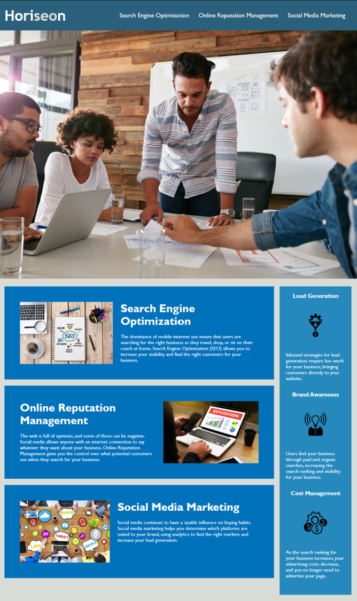

# Horiseon-Marketing-Inc Code Refactoring

## Description

To meet accessibility standards and search engine optimization, Horiseon's Marketing Agencie's website has been refactored to be more clear, concise, and retain the same look and functionality.

To accomplish this, semantic elements replaced multiple divs, alternative attribute was added to images, broken links fixed, and CSS code refactored and consolidated to reduce redundancy.

## Technologies Used
- HTML
- CSS

## Deployed Application

https://esrawameed.github.io/Horiseon-Marketing-inc-1/

